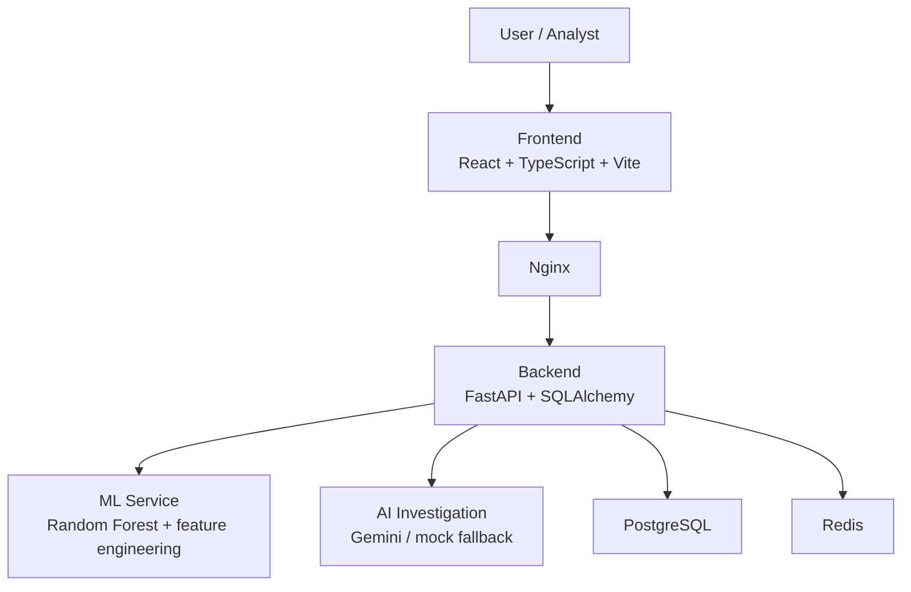

# RazorGuard

RazorGuard is an AI-powered payment fraud detection and investigation platform built for the **Razorpay AI Buildathon — Track 02: AI Risk Manager**.

It combines machine learning fraud scoring, behavioral risk intelligence, and AI-assisted investigation to help analysts detect and review suspicious transactions.

## Problem

Payment fraud detection requires:
- real-time risk scoring
- account history and behavioral signals
- transparency for analyst review
- secure access controls
- auditability of decisions

## Solution

RazorGuard uses a machine learning pipeline with a human-in-the-loop review workflow.

```text
Transaction
   ↓
Feature engineering
   ↓
Random Forest scoring
   ↓
Risk classification + signals
   ↓
Analyst dashboard review
   ↓
AI investigation (optional)
   ↓
Audit trail
```

## Key Features

### Machine learning fraud detection
- Random Forest classifier
- 20 engineered behavioral features
- time-safe feature engineering without future look-ahead
- fraud probability scoring in the range [0.0, 1.0]
- decision threshold fixed at 0.30

### Risk intelligence
- LOW / MEDIUM / HIGH / CRITICAL classification
- human-readable risk signals such as:
  - multiple recent failures
  - new device
  - unusual country
  - country or payment method change
  - high transaction velocity
  - unusual hour
  - amount much higher than historical average

### AI-assisted investigation
- Gemini integration via Google GenAI SDK
- optional mock fallback for local/offline runs
- investigation context includes transaction details and audit trail
- generated recommendations with confidence and limitations

### Dashboard and security
- React + TypeScript frontend
- login and profile APIs
- role-based access control
- Redis-backed login rate limiting
- audit trail for tracked actions
- PostgreSQL storage and Docker Compose setup

## Architecture



## Technology Stack

| Layer | Technologies |
|---|---|
| Backend | FastAPI, Uvicorn, Pydantic 2, SQLAlchemy 2 |
| Frontend | React 19, TypeScript, Vite, Tailwind CSS, Zustand |
| Database | PostgreSQL 15, SQLite (testing) |
| Cache | Redis 7 |
| Auth | JWT, Argon2, RBAC |
| ML | scikit-learn, pandas, numpy, joblib |
| AI | Google GenAI SDK |
| Container | Docker Compose |

## Model performance

The repository contains model metadata with held-out test metrics for the trained Random Forest model:

| Metric | Value |
|---|---:|
| Accuracy | 99.9% |
| Precision | 96.9% |
| Recall | 100% |
| F1 Score | 98.4% |
| ROC-AUC | 99.99% |
| PR-AUC | 99.93% |

Validation comparison in the project metadata includes:

| Model | Accuracy | Precision | Recall | F1 | ROC-AUC |
|---|---:|---:|---:|---:|---:|
| Random Forest | 99.87% | 97.62% | 97.62% | 97.62% | 99.99% |
| Logistic Regression | 99.37% | 81.55% | 100% | 89.84% | 99.93% |
| Isolation Forest | 93.33% | 29.58% | 100% | 45.65% | 99.83% |

These metrics are based on the synthetic evaluation data included in the repository and are intended to demonstrate ML capability in the project context.

## API overview

### Authentication
- POST /api/auth/login
- GET /api/auth/me

### Transactions
- POST /api/transactions/score
- GET /api/transactions
- GET /api/transactions/{id}

### ML and health
- GET /api/ml/status
- GET /api/ml/metrics
- GET /api/system/health

### AI and audit
- POST /api/transactions/{id}/investigate
- GET /api/audit

### Admin
- GET /api/admin/users
- GET /api/admin/stats
- GET /api/system/info

## Example predictions

### Fraudulent transaction
```json
{
  "fraud_probability": 0.9996,
  "risk_level": "CRITICAL",
  "decision": "REVIEW",
  "risk_signals": [
    "Multiple recent failures",
    "New device",
    "Unusual country"
  ]
}
```

### Legitimate transaction
```json
{
  "fraud_probability": 0.0,
  "risk_level": "LOW",
  "decision": "ALLOW",
  "risk_signals": []
}
```

## Local setup

### Prerequisites
- Python 3.11+
- Node.js 20+
- Docker Desktop (recommended)
- PostgreSQL 15 and Redis 7

### 1. Configure environment
```bash
cp .env.example .env
```

Set your secrets in `.env`, including JWT settings and database/Redis values.

### 2. Backend
```bash
cd backend
python -m venv venv
# Windows
.\venv\Scripts\pip install -r requirements.txt
.\venv\Scripts\alembic upgrade head
.\venv\Scripts\python app/db/init_db.py
.\venv\Scripts\uvicorn app.main:app --reload
```

### 3. Frontend
```bash
cd frontend
npm install
npm run dev
```

### 4. Docker Compose
```bash
docker compose up --build
```

## Testing

Backend tests are present in the repository and include security, auth, transactions, ML, AI, audit, and health checks.

```bash
cd backend
python -m pytest tests/ -v
```

The project states a test suite count of **108 tests** across the backend test modules.

## Project structure

```text
razorguard/
├── backend/
│   ├── app/
│   │   ├── api/
│   │   ├── core/
│   │   ├── models/
│   │   ├── schemas/
│   │   ├── services/
│   │   └── db/
│   ├── tests/
│   ├── requirements.txt
│   └── alembic/
├── frontend/
│   ├── src/
│   ├── package.json
│   └── nginx.conf
├── ml/
│   ├── artifacts/
│   ├── features.py
│   ├── train.py
│   └── requirements.txt
├── data/
├── docs/
├── docker/
├── scripts/
├── docker-compose.yml
├── .env.example
├── README.md
└── package.json
```

## Documentation

- [docs/architecture.md](docs/architecture.md)
- [docs/ml-pipeline.md](docs/ml-pipeline.md)
- [docs/model-card.md](docs/model-card.md)

## License

Private project for the Razorpay AI Buildathon.
