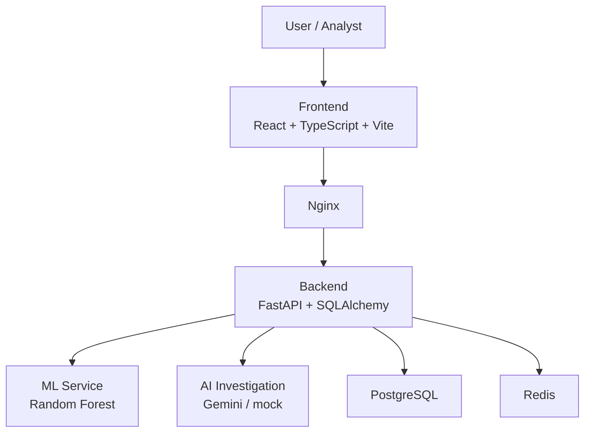

# RazorGuard

> **Razorpay AI Buildathon — Track 02: AI Risk Manager**

RazorGuard is an AI-powered payment fraud detection and investigation platform. It combines a machine-learning scoring pipeline, real-time behavioral risk intelligence, and Gemini-assisted investigation to give payment analysts a single, auditable workspace for detecting and reviewing suspicious transactions.

---

## The Problem

Modern payment fraud requires more than rule-based filters. Analysts need:

- **Real-time risk scoring** — flag suspicious activity before settlement
- **Behavioral signals** — device, velocity, geography, and account history
- **Explainability** — why was this flagged? what should I do?
- **Auditability** — every decision logged for compliance
- **Secure access** — role-based controls so the right people see the right data

---

## The Solution

RazorGuard wraps a full ML fraud pipeline in a human-in-the-loop review workflow:

```
Transaction submitted
       ↓
Feature engineering (20 behavioral features)
       ↓
Random Forest scorer → fraud probability [0.0 – 1.0]
       ↓
Risk classification: LOW / MEDIUM / HIGH / CRITICAL
       ↓
Human-readable risk signals generated
       ↓
Analyst reviews on dashboard
       ↓
Optional: Gemini AI investigation report
       ↓
Decision + full audit trail persisted
```

---

## Key Features

### 🤖 Machine Learning Fraud Detection
- Random Forest classifier trained on 20 engineered behavioral features
- Time-safe feature engineering — no future look-ahead leakage
- Fraud probability output in `[0.0, 1.0]`; decision threshold at `0.30`
- Model versioned and serialized via joblib; hot-loadable at runtime

### 🚨 Risk Intelligence
Four-tier classification with human-readable signals:

| Level | Probability | Decision |
|---|---|---|
| LOW | < 0.30 | ALLOW |
| MEDIUM | 0.30 – 0.60 | MONITOR |
| HIGH | 0.60 – 0.85 | REVIEW |
| CRITICAL | ≥ 0.85 | REVIEW |

Signals include: `Multiple recent failures`, `New device`, `Unusual country`, `Payment method changed`, `High transaction velocity`, `Unusual transaction hour`, `Amount much higher than average`.

### 🔍 AI-Assisted Investigation
- Gemini (Google GenAI SDK) generates structured investigation reports
- Report includes: summary, key evidence, risk reasoning, recommended action, confidence, limitations
- Mock fallback for offline/local runs — no API key required for demo
- Pre-cached AI report for the hero fraud transaction (`TXN_HERO_FRAUD_001`)

### 🛡️ Dashboard & Security
- React 19 + TypeScript + Vite frontend
- Role-based access control: `admin`, `analyst`, `viewer`
- JWT authentication with Argon2 password hashing
- Redis-backed login rate limiting
- Full audit trail for every scored transaction and AI investigation

---

## Architecture



---

## Technology Stack

| Layer | Technologies |
|---|---|
| Backend | FastAPI, Uvicorn, Pydantic v2, SQLAlchemy 2, Alembic |
| Frontend | React 19, TypeScript, Vite, Tailwind CSS, Zustand |
| Database | PostgreSQL 15, SQLite (testing) |
| Cache | Redis 7 |
| Auth | JWT, Argon2, RBAC |
| ML | scikit-learn, pandas, NumPy, joblib |
| AI | Google GenAI SDK (Gemini) |
| Infra | Docker Compose, Nginx |

---

## Model Performance

Trained Random Forest — held-out test set metrics:

| Metric | Value |
|---|---:|
| Accuracy | 99.9% |
| Precision | 96.9% |
| Recall | 100.0% |
| F1 Score | 98.4% |
| ROC-AUC | 99.99% |
| PR-AUC | 99.93% |

Model comparison on validation set:

| Model | Accuracy | Precision | Recall | F1 | ROC-AUC |
|---|---:|---:|---:|---:|---:|
| **Random Forest** | **99.87%** | **97.62%** | **97.62%** | **97.62%** | **99.99%** |
| Logistic Regression | 99.37% | 81.55% | 100% | 89.84% | 99.93% |
| Isolation Forest | 93.33% | 29.58% | 100% | 45.65% | 99.83% |

> Metrics are based on the synthetic evaluation dataset included in the repository and demonstrate ML pipeline capability in the buildathon context.

---

## Demo Dataset

The repository ships with a realistic 1 000-transaction demo dataset and a seeder script that scores every record through the live ML model.

**Target distribution (genuinely ML-scored):**

| Risk Level | Count | % |
|---|---|---|
| LOW | ~409 | ~41% |
| MEDIUM | ~191 | ~19% |
| HIGH | ~190 | ~19% |
| CRITICAL | ~210 | ~21% |

**Hero fraud transaction — `TXN_HERO_FRAUD_001`:**
- Amount: ₹2,45,000.00
- ML fraud probability: **0.95** (CRITICAL)
- 5 risk signals: Multiple recent failures · New device · Unusual country · Payment method changed · Unusual transaction hour
- Pre-cached AI investigation report with `BLOCK_AND_HOLD` recommendation

To regenerate and seed the demo data:

```bash
# Generate CSV
python scripts/generate_demo_data.py

# Score via ML model and seed PostgreSQL
python scripts/seed_demo_transactions.py
```

---

## API Overview

### Authentication
| Method | Endpoint | Description |
|---|---|---|
| POST | `/api/auth/login` | Obtain JWT token |
| GET | `/api/auth/me` | Current user profile |

### Transactions
| Method | Endpoint | Description |
|---|---|---|
| POST | `/api/transactions/score` | Score a transaction through ML pipeline |
| GET | `/api/transactions` | List with filters, pagination, sorting |
| GET | `/api/transactions/{id}` | Transaction detail + risk signals |

### ML & Health
| Method | Endpoint | Description |
|---|---|---|
| GET | `/api/ml/status` | ML service readiness |
| GET | `/api/ml/metrics` | Model performance metrics |
| GET | `/api/system/health` | System health check |

### AI & Audit
| Method | Endpoint | Description |
|---|---|---|
| POST | `/api/transactions/{id}/investigate` | Trigger Gemini AI investigation |
| GET | `/api/audit` | Paginated audit log |

### Admin
| Method | Endpoint | Description |
|---|---|---|
| GET | `/api/admin/users` | User management |
| GET | `/api/admin/stats` | Platform statistics |
| GET | `/api/system/info` | System information |

---

## Example Predictions

### 🔴 High-Risk (CRITICAL) Transaction
```json
{
  "fraud_probability": 0.9500,
  "risk_level": "CRITICAL",
  "decision": "REVIEW",
  "risk_signals": [
    "Multiple recent failures",
    "New device",
    "Unusual country",
    "Payment method changed",
    "Unusual transaction hour (00:00-05:59)"
  ]
}
```

### 🟢 Clean (LOW) Transaction
```json
{
  "fraud_probability": 0.0,
  "risk_level": "LOW",
  "decision": "ALLOW",
  "risk_signals": []
}
```

---

## Local Setup

### Prerequisites
- Python 3.11+
- Node.js 20+
- Docker Desktop (recommended)
- PostgreSQL 15 and Redis 7

### Option A — Docker Compose (recommended)
```bash
cp .env.example .env
# Edit .env with your secrets
docker compose up --build
```

### Option B — Manual

**1. Configure environment**
```bash
cp .env.example .env
# Edit .env: DATABASE_URL, REDIS_URL, JWT_SECRET_KEY, GOOGLE_API_KEY (optional)
```

**2. Backend**
```bash
cd backend
python -m venv venv

# Windows
.\venv\Scripts\pip install -r requirements.txt
.\venv\Scripts\alembic upgrade head
.\venv\Scripts\python app/db/init_db.py
.\venv\Scripts\uvicorn app.main:app --reload
```

**3. Frontend**
```bash
cd frontend
npm install
npm run dev
```

**4. Seed demo data**
```bash
# From repo root
python scripts/generate_demo_data.py
python scripts/seed_demo_transactions.py
```

---

## Testing

**139 tests** across security, auth, transactions, ML pipeline, AI agent, audit, and health.

```bash
# From repo root
backend\venv\Scripts\python.exe -m pytest tests/ backend/tests/ -v
```

```
===================== 139 passed in 22.91s =====================
```

---

## Project Structure

```text
razorguard/
├── backend/
│   ├── app/
│   │   ├── api/          # FastAPI route handlers
│   │   ├── core/         # Config, database, security
│   │   ├── models/       # SQLAlchemy ORM models
│   │   ├── schemas/      # Pydantic request/response schemas
│   │   ├── services/     # ML service, AI agent
│   │   └── db/           # Init scripts
│   ├── tests/            # 139 pytest tests
│   ├── requirements.txt
│   └── alembic/          # Database migrations
├── frontend/
│   ├── src/              # React + TypeScript components
│   ├── package.json
│   └── nginx.conf
├── ml/
│   ├── artifacts/        # Serialized model, preprocessor, metadata
│   ├── features.py       # Feature engineering
│   ├── train.py          # Training pipeline
│   └── requirements.txt
├── scripts/
│   ├── generate_demo_data.py   # Synthetic dataset generator
│   └── seed_demo_transactions.py  # ML-scored DB seeder
├── data/                 # transactions.csv (demo dataset)
├── docs/                 # Architecture, ML pipeline, model card
├── docker-compose.yml
├── .env.example
└── README.md
```

---

## Documentation

- [docs/architecture.md](docs/architecture.md) — System design and component interactions
- [docs/ml-pipeline.md](docs/ml-pipeline.md) — Feature engineering and training details
- [docs/model-card.md](docs/model-card.md) — Model card with performance, limitations, and intended use

---

## License

Private project submitted for the **Razorpay AI Buildathon — Track 02**.
